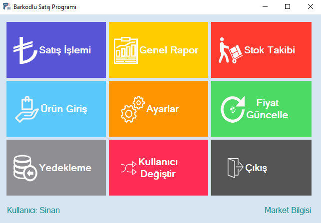

<div align="center">
  
</div>

##  ABOUT THE BARCODE SALES PROJECT

<br>

Barcoded sales program is a software that allows businesses such as markets, grocery stores, buffets and gas stations to record their products with their buying and selling prices, make sales, and view their turnover and profits by reporting. With a market program, you can identify all the products in your business and sell them by scanning the product barcodes without having to memorize the prices of these products.

### What can be done with the market program?

* You can carry out all your product, sales, stock, reporting and personnel transactions in your market.

* You can see the receipt amount by scanning your products on the sell page, calculate the change with the change feature and apply discounts to your customers. With the quick add product menu, you can add your products to the receipt by clicking on the product without scanning its barcode.

* You can define product cards with stock transactions and create your products with fields such as product barcode, product name, sales price, purchase price, product group, stock code and product description. You can perform stock tracking operations by defining your product stock quantity.

* With the Reports module, you can accurately track your turnover and profit by making end-of-day, between-date, product-based, regional, stock movement and product groups-based reports.

* With the product entry module, you can easily put the products on sale with the program and handle the stock transactions in a practical way.

* With the Settings module, you can perform personnel transactions/authorizations, printing transactions, card commission information, workplace information and backup/restore from backup.

* Change user module is designed to manage user change operations in your barcoded sales program. It allows you to quickly switch between users and increases security and management flexibility by adding different user accounts to the system.

* The price update module is a tool that allows you to quickly and effectively manage product prices in your barcode sales program. This module offers the opportunity to update product prices collectively or individually, so you can manage your sales and stock tracking more precisely.

##  PROJECT SCHEME

<pre>
├── <a href="/images/sales/">SALES & RETURN PROCESS</a>
│   ├── Cash Sales
│   ├── Card Sales
│   ├── Cash - Card Sales
│   ├── Quick Product Transactions
│   ├── Touchscreen Account Screen
│   ├── Selling Unregistered Product
│   ├── Printing Receipt
│   ├── Multi-Sale Transaction (Transaction Hold)
│   └── Return Transactions
├── <a href="/images/report/">GENERAL REPORT</a>
│   ├── Sales Report
│   ├── Return Report
│   ├── Income (Excluding Sales) Report
│   ├── Expense (Excluding Returns) Report
│   ├── Detailed Sales Report
│   ├── Adding Income or Expense Outside Sales or Returns
│   ├── Printable Report Retrieval Module
│   └── Filtering Between Two Dates with Adjustment
├── <a href="/images/stock/">INVENTORY TRACKING</a>
│   ├── Stock Status by Product Group
│   ├── Retrieving Printable Stock Report
│   └── Monitoring Stock Entries
├── <a href="/images/add-product/">PRODUCT ENTRY</a>
│   ├── Quantity / Weight Product Transactions
│   ├── Adding Product Group
│   ├── Exporting Products to Excel
│   ├── Deleting Product
│   ├── Editing Product
│   ├── Bulk Product Deactivation
│   └── Activating / Deactivating Products
├── <a href="/images/settings/">SETTINGS</a>
│   ├── Personnel Management
│   ├── Personnel Authorization Operations
│   ├── Printer - Scale - Commission Operations
│   ├── Updating Business Information
│   └── Backup / Restore Operations
├── <a href="/images/price-update/">PRICE UPDATE</a>
│   └── Quick Price Update
├── <a href="/images/backup/">BACKUP / RESTORE</a>
│   ├── Database Backup
│   └── Restoring Taken Backup
├── <a href="/images/users-operation/">PERSONNEL CHANGE</a>
│   └── Personnel Change Operation
└── <a href="/images/licence/">LICENSE OPERATIONS</a>
    ├── 10-Day Demo Operation
    └── Annual Licensing Operation
</pre>

##  TOOLS


##  PROJECT App.config FILE

```xml
<?xml version="1.0" encoding="utf-8"?>
<configuration>
  <configSections>
    <!-- For more information on Entity Framework configuration, visit http://go.microsoft.com/fwlink/?LinkID=237468 -->
    <section name="entityFramework" type="System.Data.Entity.Internal.ConfigFile.EntityFrameworkSection, EntityFramework, Version=6.0.0.0, Culture=neutral, PublicKeyToken=b77a5c561934e089" requirePermission="false" />
  </configSections>
  <startup>
    <supportedRuntime version="v4.0" sku=".NETFramework,Version=v4.7.2" />
  </startup>
  <connectionStrings>
    <add name="BarcodeSalesDbEntities" connectionString="metadata=res://*/Model1.csdl|res://*/Model1.ssdl|res://*/Model1.msl;provider=System.Data.SqlClient;provider connection string=&quot;data source=(LocalDB)\MSSQLLocalDB;attachdbfilename=|DataDirectory|\BarcodeSalesDb.mdf;integrated security=True;MultipleActiveResultSets=True;App=EntityFramework&quot;" providerName="System.Data.EntityClient" />
  </connectionStrings>
  <entityFramework>
    <defaultConnectionFactory type="System.Data.Entity.Infrastructure.LocalDbConnectionFactory, EntityFramework">
      <parameters>
        <parameter value="mssqllocaldb" />
      </parameters>
    </defaultConnectionFactory>
    <providers>
      <provider invariantName="System.Data.SqlClient" type="System.Data.Entity.SqlServer.SqlProviderServices, EntityFramework.SqlServer" />
    </providers>
  </entityFramework>
</configuration>
```

## License Duration Calculation
You can adjust the license period with Excel located in the project root folder.

## Login Information
* Username: sinan
* Password: sinan

##  Contact Information

You can reach out to me using the following contact details:

[](mailto:info@sinanozcelik.com)

[](https://sinanozcelik.com)

I'm always open to development and collaboration. Feel free to reach out to me!