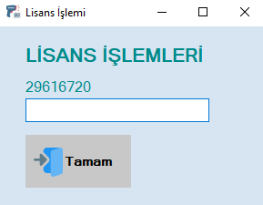

## LICENSE OPERATIONS

### 10 Day Trial License

You can try this software for free for 10 days. At the end of the trial period, you will need to purchase a license to upgrade to the full version of the software. During the trial period, you can use all the features of the software and evaluate its performance.

### Annual Full Version License
This license type provides annual access to the full version of the software. During the annual license period, you have free access to all updates and support services of the software.



```c#
public string CpuNo()
{
    string islemciId = "";
    ManagementObjectSearcher ara = new ManagementObjectSearcher("Select * From WIN32_Processor");
    ManagementObjectCollection obje = ara.Get();
    foreach (ManagementObject item in obje)
    {
        islemciId = item["ProcessorId"].ToString();
    }

    return islemciId;
}

public int CpuKarakterToplam()
{
    int toplam = 0;
    foreach (char item in CpuNo().ToCharArray())
    {
        toplam += (int)item;
    }

    return toplam;
}
// AZLFCQ 2 9 3
public string gunKarakter = "AZPOPOWFLSCDXKEMLVNGKVZCOQGBMUIRYNHTXYSJLKFDCPOJQWESDCVVREERXVLMHUNQWZKBGWYPFZMWG";
public string ayKarakter = "LFLSCXKZVNGMPODWKEQCOAZDXVPTIJYRBUNHZGVAKLMYERPSJIXCQERYTFDGCXVEETSDFSFDSTUNXW";
public string yilKarakter = "CQZXVNGPOWSFXKDLMCOAZLVEKUHTJXIRYBNAJKFWOPZSQIRYHSDFSDFSDFSDFSDFSDFSDFSDFSDBTCXSNLKU";

public bool TarihKontrol(DateTime baslangic, DateTime bitis)
{
    return baslangic < DateTime.Now && DateTime.Now < bitis;
}

public int GirilenLisansiKontrolEt(string girilenLisansBilgisi)
{
    Cursor.Current = Cursors.WaitCursor;
    double girilen = Convert.ToDouble(girilenLisansBilgisi);
    bool demoMu = girilen == CpuKarakterToplam() * TarihFonksiyon() * 3;
    bool yillikMi = girilen == CpuKarakterToplam() * TarihFonksiyon() * 13;
    int durum = 0;

    if (demoMu)
    {
        durum = 1; // Demo kurulum için 1 döndürülür //
    }
    else if (yillikMi)
    {
        durum = 2; // Demo için yıllık kayıt yapılacak //
    }
    else
    {
        durum = 0; // Lisans uyuşmuyor ise hata //
    }
    Cursor.Current = Cursors.Default;

    return durum;
}

public DateTime DemoTarihOlustur()
{
    DateTime tarih = DateTime.Now.AddDays(10);
    return tarih;
}

public DateTime YillikTarihOlustur()
{
    DateTime tarih = DateTime.Now.AddYears(1);
    return tarih;
}

public long EkrandaGoster()
{
    long gosterilecekNo = CpuKarakterToplam() * TarihFonksiyon();
    return gosterilecekNo;
}

public long TarihFonksiyon()
{
    return (DateTime.Now.Day + DateTime.Now.Month) * DateTime.Now.Year;
}

public DateTime TarihCoz(string sifreliTarih)
{
    string strGun = sifreliTarih.Substring(0, 2);
    string strAy = sifreliTarih.Substring(2, 2);
    string strYil = sifreliTarih.Substring(4, 2);
    int gun = gunler().Where(x => x.Ad == strGun).First().Numara;
    int ay = aylar().Where(x => x.Ad == strAy).First().Numara;
    int yil = yillar().Where(x => x.Ad == strYil).First().Numara;
    DateTime tarih = new DateTime(yil, ay, gun);

    return tarih;
}

public string TarihSifrele(DateTime tarih)
{
    int gun = tarih.Day;
    int ay = tarih.Month;
    int yil = tarih.Year;
    string strGun = gunler().Where(x => x.Numara == gun).First().Ad;
    string strAy = aylar().Where(x => x.Numara == ay).First().Ad;
    string strYil = yillar().Where(x => x.Numara == yil).First().Ad;
    string olusanSifreliTarih = strGun + strAy + strYil;

    return olusanSifreliTarih;
}

public List<Sablon> gunler()
{
    List<Sablon> listGun = new List<Sablon>();
    for (int i = 0; i < 31; i++)
    {
        listGun.Add(new Sablon { Numara = i + 1, Ad = gunKarakter.ToString().Substring(i * 2, 2) });
    }

    return listGun;
}

public List<Sablon> aylar()
{
    List<Sablon> listAy = new List<Sablon>();
    for (int i = 0; i < 12; i++)
    {
        listAy.Add(new Sablon { Numara = i + 1, Ad = ayKarakter.ToString().Substring(i * 2, 2) });
    }

    return listAy;
}

public List<Sablon> yillar()
{
    List<Sablon> listYil = new List<Sablon>();
    int karakterSayisi = 0;
    for (int i = 2023; i < 2033; i++)
    {
        listYil.Add(new Sablon { Numara = i, Ad = yilKarakter.ToString().Substring(karakterSayisi * 2, 2) });
        karakterSayisi += 2;
    }

    return listYil;
}

public class Sablon
{
    public int Numara { get; set; }
    public String Ad { get; set; }
}
```