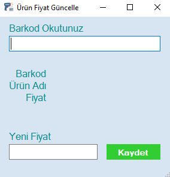

## QUICK PRICE UPDATE

The price update module is a tool that allows you to quickly and effectively manage product prices in your barcode sales program. This module offers the opportunity to update product prices collectively or individually, so you can manage your sales and stock tracking more precisely.

