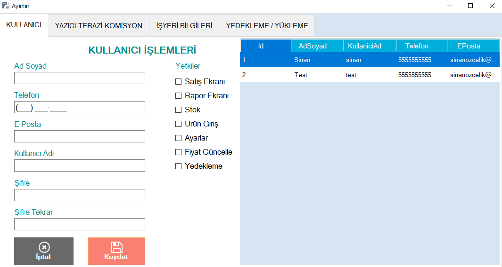
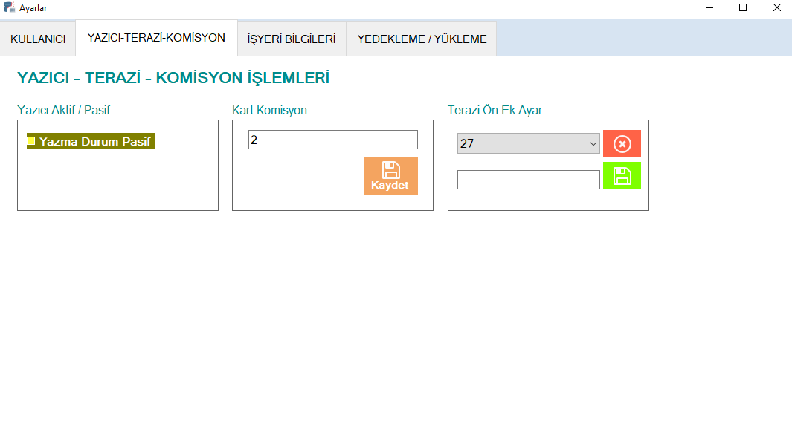
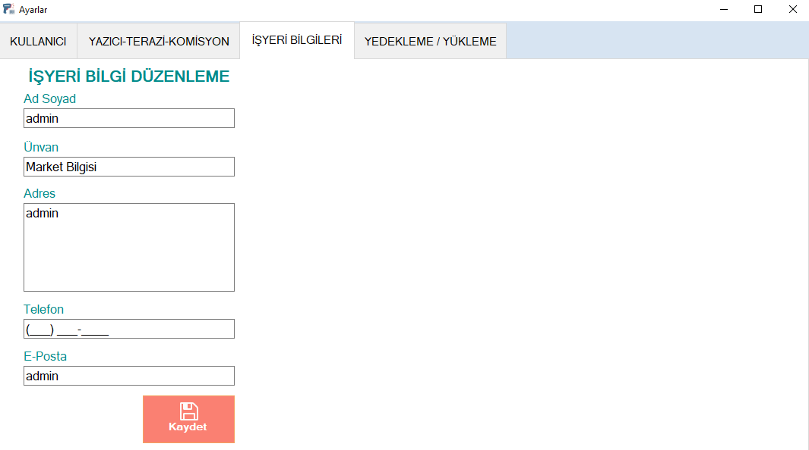
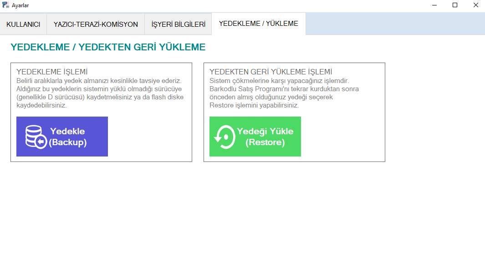

## SETTINGS

With the Settings module, you can perform personnel transactions/authorizations, printing transactions, card commission information, workplace information and backup/restore from backup.

