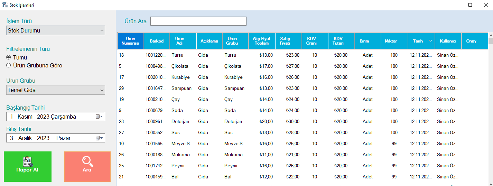
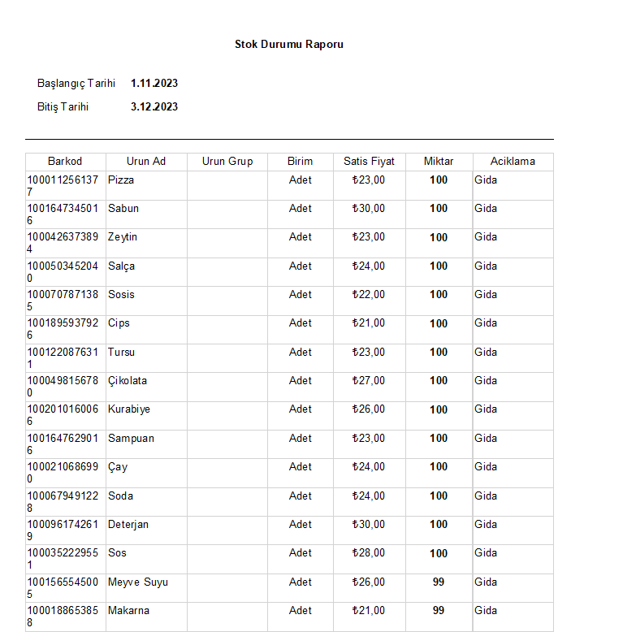

## INVENTORY TRACKING

You can define product cards with stock transactions and create your products with fields such as product barcode, product name, sales price, purchase price, product group, stock code and product description. You can perform stock tracking operations by defining your product stock quantity.

